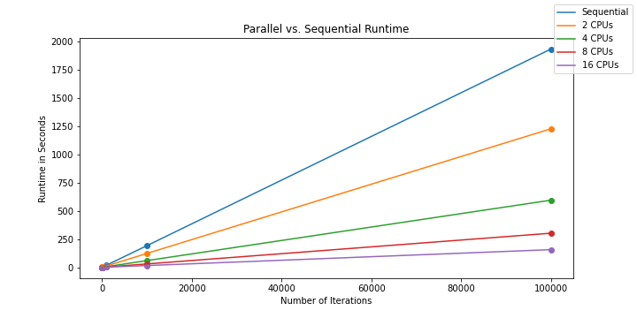
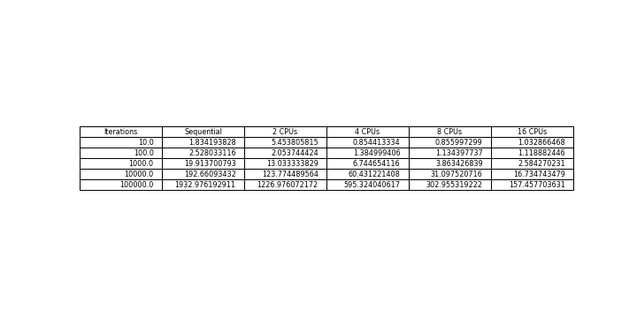

<h1>Heat Distribution</h1>

<h2>Synopsis</h2>

  The purpose of this project is to demonstrate psuedo-linear speedup on a parallelized algorithm. 
  The algorithm simulates heat dissipation from a fireplace. The algorithm uses data partitioning
  to separate the computation accross the computing nodes, and uses the Message Passing Interface 
  (MPI) to transfer computed data across nodes. 

  Usage instructions are explained in the "usage_instructions.txt" file. 

<h2>Visualization</h2>
<body>
  This is the output image displaying how the heat in the room dissipates after 100,000 iterations
  
</body>

<h2>Results</h2>
<body>
  This graph shows how the runtime changes according to the number of computing nodes. 
  
</body>

<body>
  This table shows the runtime (in seconds) according to each respective number of computing nodes.
  
</body>

<body>
  To see these plots and their creation more clearly, they are shown in the "Runtime_Visualization.ipynb" file. 
</body>
